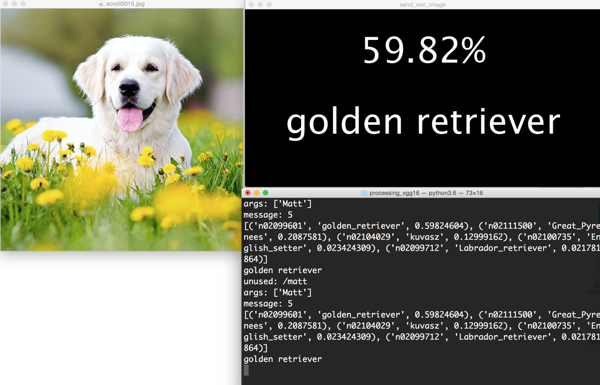

# Processing Keras OSC
> Get processing (or any other OSC receiving platform) talking to a Keras VGG16 script for basic, general object recognition



## Installation

OS X & Linux:

```sh
cd processingVGG16
python install -r requirements.txt
python receive_osc_vgg.py
```

## Motivation
Run object recognition with python and send it output via OSC to Processing (or any other software). The process:
    1) Take a screenshot of an image
    2) process it with OpenCV and Keras
    3) send results via OSC to another program

This is useful in art/performance settings to incorporate general object recognition. This could also work with ResNet, MobileNet, or a custom model.


## Release History

* 0.0.1
    * Work in progress

## Meta

Matthew Kenney – mk365@duke.edu

[https://github.com/matthewbaykenney/processing_keras_osc](https://github.com/matthewbaykenney/processing_keras_osc)

## Contributing

1. Fork it (<https://github.com/matthewbaykenney/processing_keras_osc/fork>)
2. Create your feature branch (`git checkout -b feature/fooBar`)
3. Commit your changes (`git commit -am 'Add some fooBar'`)
4. Push to the branch (`git push origin feature/fooBar`)
5. Create a new Pull Request